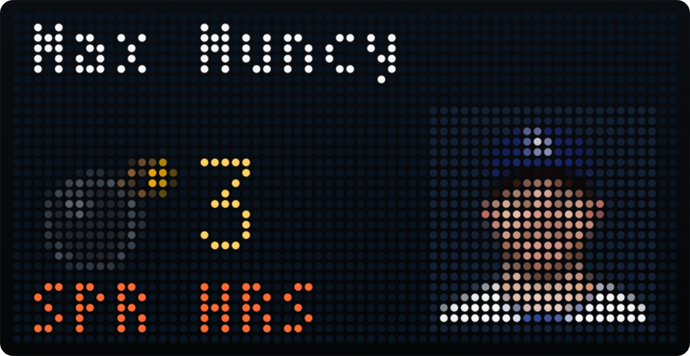
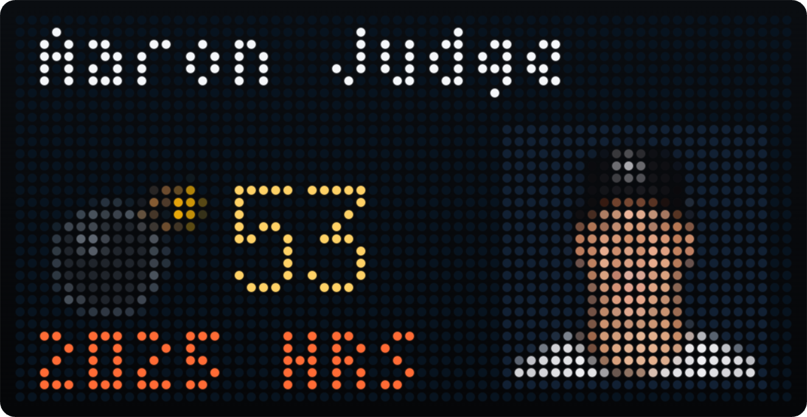

The Bomb Tracker is a Tidbyt app that tracks your favorite player and teams home runs for the year

*** What it does ***

* Lets the user pick a player or team through a text box
* Shows live home run totals from the MLB Stats API
* Displays the player's MLB headshot or team logo on the right side of the layout
* Shows spring training home runs if not regular season yet
* Auto switches to regular season once it starts

*** Preview ***

Spring training preview :

Regular season preview :

 